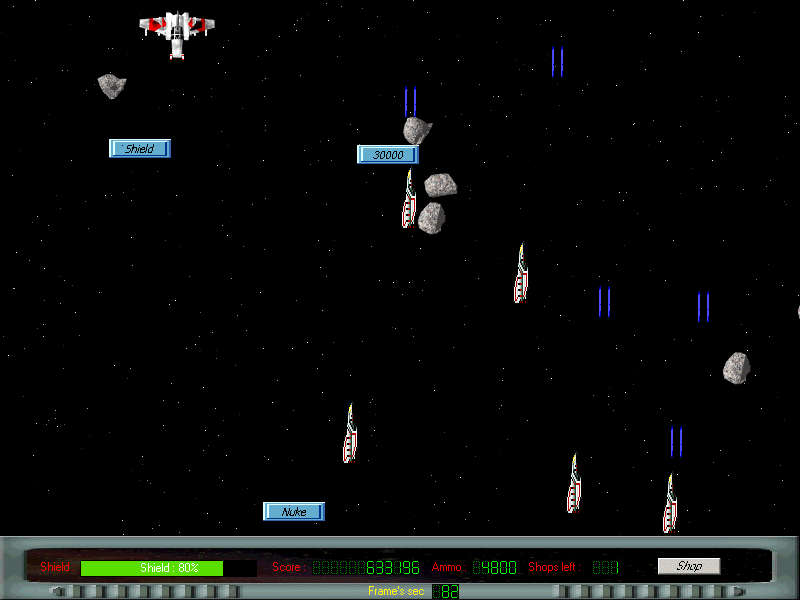



## Space Shooter \(Direct X Game\)

### Description

This is a game called spaceshooter. This was my frist game it has flip stereo, music, a shop to buy and upgrade weapons. After download unpack and read the readme.txt. Requires DirectX 7

or higher (for sound).

i saw that some guys not know the controls well:

'arrowkeys' for moving a round

'enter' to enter shop realy cool!!

'ecs' to quit

'spacebar' to launch nuke (if you have one)

'ctrl' to shoot with cannons

Cheats :

god mode : press 'delete' key then enter newlive

more Score : press 'delete' key then enter egbert

tell me what you think (vote) and tell me your new hi-score!

thx egbert
 
### More Info
 

             |
---                |---
**Submitted On**   |2001-01-05 14:48:22
**By**             |[egbert](https://github.com/Planet-Source-Code/PSCIndex/blob/master/ByAuthor/egbert.md)
**Level**          |Intermediate
**User Rating**    |4.8 (29 globes from 6 users)
**Compatibility**  |VB 6\.0
**Category**       |[Games](https://github.com/Planet-Source-Code/PSCIndex/blob/master/ByCategory/games__1-38.md)
**World**          |[Visual Basic](https://github.com/Planet-Source-Code/PSCIndex/blob/master/ByWorld/visual-basic.md)
**Archive File**   |[CODE\_UPLOAD139591202001\.zip](https://github.com/Planet-Source-Code/egbert-space-shooter-direct-x-game__1-14576/archive/master.zip)

